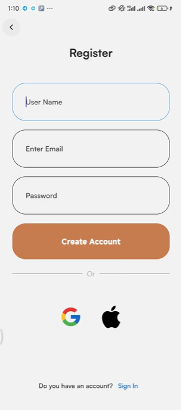
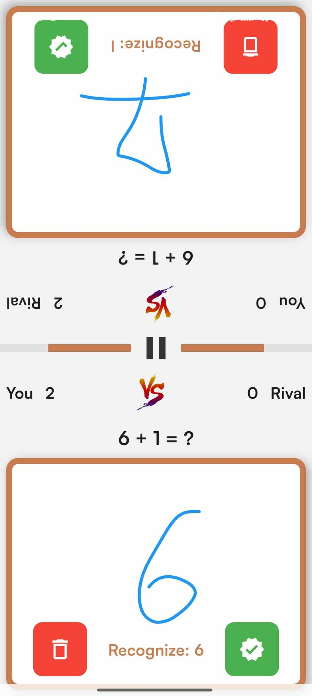

# Raccoon Learning App
Project Raccoon Learning is my graduation project, and due to security and confidentiality reasons, I am unable to make the source code public. However, I will share screenshots showcasing the features and functionalities I have developed.
## Preview of My Project
Raccoon Learning is a mobile application designed for children in grades 1–3 to practice math calculations and engage in real-time competitive matches by drawing their answers on the screen. The app features authentication, an achievement system, and an in-app store, allowing users to save their progress to Firestore.

<table>
  <tr>
    <td></td>
    <td></td>
    <td></td>
  </tr>
  <tr>
    <td></td>
    <td></td>
    <td></td>
  </tr>
  <tr>
    <td></td>
    <td></td>
    <td></td>
  </tr>
  <tr>
    <td></td>
    <td></td>
    <td></td>
  </tr>
  <tr>
    <td></td>
    <td></td>
    <td></td>
  </tr>
  <tr>
    <td></td>
    <td></td>
    <td></td>
  </tr>
  <tr>
    <td></td>
    <td></td>
    <td></td>
  </tr>
  <tr>
    <td></td>
    <td></td>
    <td></td>
  </tr>
  <tr>
    <td></td>
    <td></td>
    <td></td>
  </tr>
  <tr>
    <td></td>
  </tr>
</table>