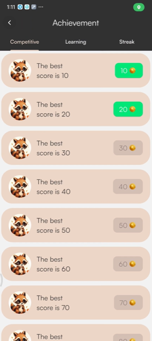

# Raccoon Learning App
Project Raccoon Learning is my graduation project, and due to security and confidentiality reasons, I am unable to make the source code public. However, I will share screenshots showcasing the features and functionalities I have developed.
## Preview of My Project
Raccoon Learning is a mobile application designed for children in grades 1–3 to practice math calculations and engage in real-time competitive matches by drawing their answers on the screen. The app features authentication, an achievement system, and an in-app store, allowing users to save their progress to Firestore.

<table style="border-collapse: collapse; border: none;">
  <tr>
    <td>
      
      
<b>Image 1:</b> Introduction Page

    </td>
    <td>
      
      
<b>Image 2:</b> Register or signin

    </td>
  </tr>
  <tr>
    <td>
      
      
<b>Image 3:</b> Register

    </td>
    <td>
      
      
<b>Image 4:</b> Sign In

    </td>
  </tr>
    <tr>
    <td>
      
      
<b>Image 5:</b> Home Page

    </td>
    <td>
      
      
<b>Image 6:</b> Learning

    </td>
  </tr>
    <tr>
    <td>
      
      
<b>Image 7:</b> Choose Mode

    </td>
    <td>
      
      
<b>Image 8:</b> Playing

    </td>
  </tr>
    <tr>
    <td>
      
      
<b>Image 9:</b> Pause Game

    </td>
    <td>
      
      
<b>Image 10:</b> Achievement Page

    </td>
  </tr>
    <tr>
    <td>
      
      
<b>Image 11:</b> Claimed Achievement

    </td>
    <td>
      
      
<b>Image 12:</b> Store Page

    </td>
  </tr>
    <tr>
    <td>
      
      
<b>Image 13:</b> Profile Page

    </td>
    <td>
      
      
<b>Image 14:</b> Choose avatar to change (can buy from store)

    </td>
  </tr>
    <tr>
    <td>
      
      
<b>Image 15:</b> Change successful

    </td>
    <td>
      
      
<b>Image 16:</b> Avatar is changed in Home

    </td>
  </tr>
    </tr>
    <tr>
    <td>
      
      
<b>Image 17:</b> Choose mode in competitive

    </td>
    <td>
      
      
<b>Image 18:</b> Waiting other player

    </td>
  </tr>
    </tr>
    <tr>
    <td>
      
      
<b>Image 19:</b> Gamplay Interface Competitive

    </td>
    <td>
      
      
<b>Image 20:</b> Win interface

    </td>
  </tr>
    </tr>
    <tr>
    <td>
      
      
<b>Image 21:</b>  Lose interface

    </td>
    <!-- <td>
      
      
<b>Image 16:</b> Avatar is changed in Home

    </td> -->
  </tr>
</table>
